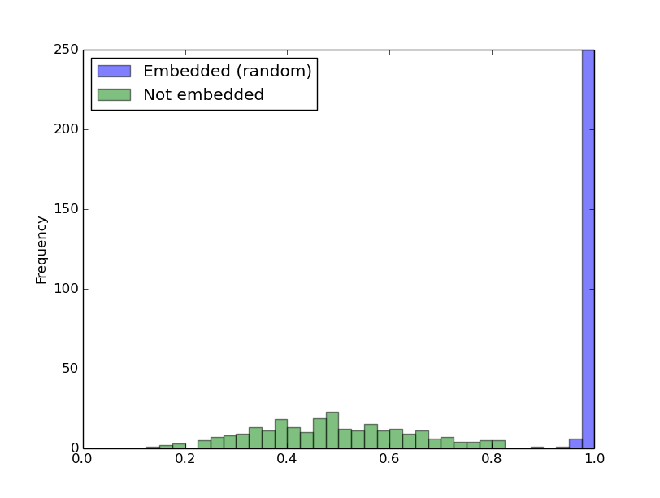

Embedding Fingerprints into Deep Neural Networks
====
This code is the implementation of "Embedding Watermarks into Deep Neural Networks" [1] and of "DeepMarks: A Secure Fingerprinting Framework for Digital
Rights Management of Deep Learning Models" [2]. It embeds a digital fingerprint into deep neural networks in training the host network. This embedding is achieved by a parameter regularizer.

This README will be updated later for more details.

## Requirements
Tensorflow 2.12.0, numpy, matplotlib, scikit-learn, pandas

## Usage
Embed a watermark in training a host network:

```sh
# train the host network while embedding a watermark
python train_wrn.py config/train_random_min.json
```

Train the host network *without* embedding:

```sh
# train the host network without embedding
python train_wrn.py config/train_non_min.json 
```

Extracted watermarks from the embedded host network and the non-embedded networks:



## License
All codes are provided for research purposes only and without any warranty.
When using any code in this project, we would appreciate it if you could refer to this project.


## References
[1] Y. Uchida, Y. Nagai, S. Sakazawa, and S. Satoh, "Embedding Watermarks into Deep Neural Networks", ICMR, 2017.
[2] Huili Chen, Bita Darvish Rouhani, Cheng Fu, Jishen Zhao, and Farinaz Koushanfar, "DeepMarks: A Secure Fingerprinting 
    Framework for Digital Rights Management of Deep Learning Models", ICMR, 2019
