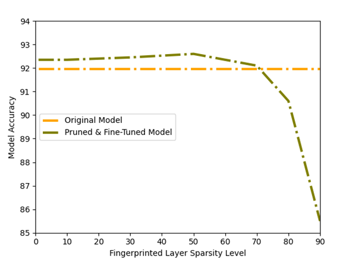

Securing Deep Neural Networks with Embedded Fingerprints
====
Implementing concepts from two research papers, specifically "Embedding Watermarks into Deep Neural Networks" [1] 
and "DeepMarks: A Secure Fingerprinting Framework for Digital Rights Management of Deep Learning Models" [2], 
the code embeds a digital fingerprint into a wide residual network  throughout the training process. 
The embedding is achieved by applying a parameter regularizer to the target layer.

The project  incorporates attacks on the model aimed at assessing the robustness of the embedded fingerprint.
These assessments include a pruning attack directed at the embedded layer and a model quantization procedure, 
both of which are conducted during the fine-tuning process. The results of these evaluations are presented below.

For further reference, you can access the original project through the following link: https://github.com/yu4u/dnn-watermark

## Requirements
```sh
pip install tensorflow==2.12.0 
pip install scikit-learn==1.2.2 
pip install tensorflow-model-optimization==0.7.5
```

## Embedding Process
Embed the fingerprint during the training phase of the model:

```sh
python train_model.py config/train_embed.json
```

Train an additional model *without* embedding:

```sh
python train_model.py config/train_non.json 
```

Visualize the difference between the fingerprints of the embedded and the non-embedded model:

```sh
python utility/check_embedded_fingerprint.py 
```

As can be observed, the distribution of the embedded fingerprint exhibits a strong similarity to that of a binary vector,
while the non-embedded one is dispersed.


## Pruning:

Prune the fingerprinted layer while fine-tuning the model:

```sh
python attacks/pruning.py config/pruning_settings.json
```

Visualize the difference between the fingerprints of the pruned and the original model:

```sh
python utility/extract_pruned_fingerprint.py 
```
As depicted in the graphic below, 
the fingerprint accuracy begins to decline when reaching a 40% sparsity level within the embedded layer, 
at which point the fingerprint dispersion surpasses the 0.85 threshold required for code-vector extraction.


While examining the model accuracy results, it becomes evident that the decrease in model accuracy occurs only 
after exceeding a 70% sparsity level within the target layer.



## License
All code in this repository is protected by copyright law and is provided for specific usage outlined below. 
By using this code, you agree to adhere to the following guidelines:

1. **Mandatory Referencing**: You are required to acknowledge and reference this project in your work whenever you use 
or adapt any code from this repository.

2. **Permitted Usage**: This code is intended for research and educational purposes only. 
Any other use requires explicit written permission from the copyright holder.

3. **No Warranty**: This code is provided without any warranties or guarantees. 
The copyright holder is not responsible for any damages or issues resulting from its use.

For questions, permissions, or inquiries related to this project, please open an issue in the 
[GitHub Issue Tracker](https://github.com/AlexandraPosa/fingerprint-embedding-wrn/issues). 
Thank you for your cooperation and adherence to these guidelines.

## References
[1] Y. Uchida, Y. Nagai, S. Sakazawa, and S. Satoh, "Embedding Watermarks into Deep Neural Networks", ICMR, 2017. \
[2] Huili Chen, Bita Darvish Rouhani, Cheng Fu, Jishen Zhao, and Farinaz Koushanfar, "DeepMarks: A Secure Fingerprinting 
    Framework for Digital Rights Management of Deep Learning Models", ICMR, 2019
