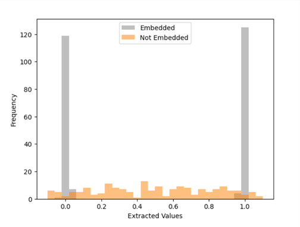

Embedding Fingerprints into Deep Neural Networks
====
Implementing concepts from two research papers, specifically "Embedding Watermarks into Deep Neural Networks" [1] 
and "DeepMarks: A Secure Fingerprinting Framework for Digital Rights Management of Deep Learning Models" [2], 
the code embeds a digital fingerprint into a wide residual network  throughout the training process. 
The embedding is achieved by a parameter regularizer.

The code has been revised to accommodate Tensorflow version 2.12.0. 
For further reference, you can access the original project through the following link: https://github.com/yu4u/dnn-watermark

## Requirements
```sh
pip install tensorflow == 2.12.0 
pip install scikit-learn == 1.2.2 
```

## Usage
Embed the fingerprint during the training phase of the host network:

```sh
python train_wrn.py config/train_random_min.json
```

Train the host network *without* embedding:

```sh
python train_wrn.py config/train_non_min.json 
```

Extracted fingerprints from the embedded host network and the non-embedded network:



## License
All codes are provided for research purposes only and without any warranty.
When using any code in this project, we would appreciate it if you could refer to this project.


## References
[1] Y. Uchida, Y. Nagai, S. Sakazawa, and S. Satoh, "Embedding Watermarks into Deep Neural Networks", ICMR, 2017. \
[2] Huili Chen, Bita Darvish Rouhani, Cheng Fu, Jishen Zhao, and Farinaz Koushanfar, "DeepMarks: A Secure Fingerprinting 
    Framework for Digital Rights Management of Deep Learning Models", ICMR, 2019
