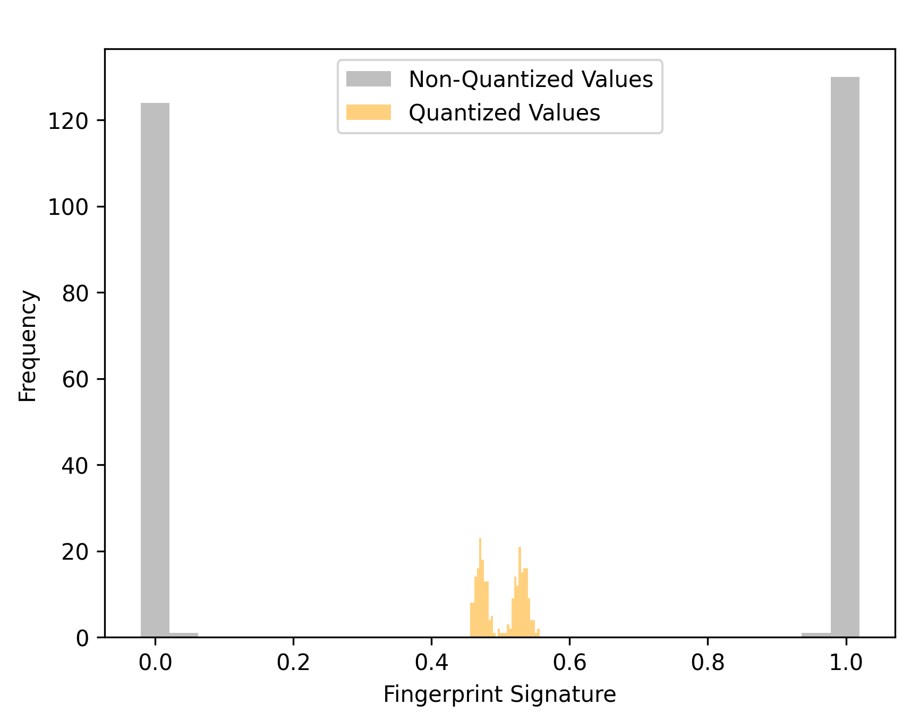

Fingerprinting: Enhancing Deep Neural Network Security
====
Fingerprinting is the process of embedding unique markers within a model to verify its authenticity and integrity. 
It not only facilitates the distinction between different users of the same model, enabling traceability and accountability, 
it also plays a crucial role in ensuring the secure deployment of machine learning models through the establishment of device-specific fingerprints.
As deep neural networks continue to find applications in sensitive domains, 
fingerprinting techniques contribute to maintaining the reliability and security of AI systems, 
which is crucial in our interconnected world.

Taking inspiration from two seminal research papers, namely:
 + 'DeepMarks: A Secure Fingerprinting Framework for Digital Rights Management of Deep Learning Models' [1]
 + 'DeepAttest: An End-to-End Attestation Framework for Deep Neural Networks' [2]

this project's core aim is to seamlessly integrate a digital fingerprint into a wide residual network during the training process.
The embedding process is achieved by applying a parameter regularizer to the specific convolutional layer. 
These parameter regularizers are mathematical tools that introduce supplementary constraints or penalties to the layer's weights. 
This process fundamentally guides the neural network, 
allowing it to adapt its parameters to seamlessly incorporate the additional fingerprint data while upholding the model's overall performance.

In the context of wide residual networks, 
it is imperative to observe that its residual blocks exhibit an enhanced width in comparison to standard residual networks. 
This enhanced width translates to a greater number of filters within each convolutional layer of a residual block. 
The advantage of such widened blocks lies in their ability to capture a more extensive spectrum of features and intricate patterns within the data, 
thereby enabling the network to acquire richer and more nuanced representations.

Within the scope of this project, a comprehensive evaluation of the embedded fingerprint's robustness has been conducted. 
The purpose of these evaluations is to rigorously examine how well the digital fingerprint withstands various challenges and adversarial scenarios. 
Two primary assessment techniques have been employed:

1. **Pruning Attack on the Embedded Layer**: 
One of the pivotal evaluations entails a pruning attack strategically directed at the embedded layer within the deep neural network. 
Pruning is a technique used to reduce the model's size by removing less significant weights. 
By subjecting the embedded layer to a pruning attack, 
the project seeks to assess whether the fingerprint remains intact and resilient even when the model undergoes compression. 
This evaluation sheds light on the robustness of the embedded information under conditions where model size optimization is essential.

2. **Model Quantization Procedure**: 
The second evaluation method involves a model quantization procedure. 
Model quantization aims to reduce the precision of numerical values within the neural network
by transitioning from floating-point values to fixed-point or integer values. 
This process can introduce quantization errors and challenges to the original model. 
By quantizing the model, the project aims to assess how well the embedded fingerprint withstands these alterations, 
emphasizing the need for the fingerprint to remain distinguishable and functional even when model parameters are constrained to reduced precision.

Both of these evaluations are carried out meticulously during the fine-tuning process, 
ensuring that they are integrated into the model's development and optimization stages. 
This approach provides valuable insights into the resilience and effectiveness of the embedded fingerprint 
under real-world conditions and potential adversarial scenarios.
The detailed results and findings from these robustness assessments are meticulously documented and presented below, 
offering a comprehensive understanding of the security and stability of the embedded fingerprint within the deep learning model.

For your future reference, you can access the code underpinning this project via the following link: https://github.com/yu4u/dnn-watermark [3]

## Requirements
```sh
pip install tensorflow==2.12.0 
pip install scikit-learn==1.2.2 
pip install tensorflow-model-optimization==0.7.5
```

## Embedding Process
Embed the fingerprint during the training phase of the model:

```sh
python train_model.py config/train_embed.json
```

Train an additional model *without* embedding:

```sh
python train_model.py config/train_non.json 
```

Visualize the difference between the extracted fingerprints of the embedded and the non-embedded model:

```sh
python utility/check_embedded_fingerprint.py 
```

As can be observed, the embedded fingerprint exhibits a structured and binary-like distribution, 
while the non-embedded one is dispersed and devoid of any identifiable fingerprint, 
underscoring the effectiveness of the embedding process.


## Pruning

Prune the embedded layer while fine-tuning the model:

```sh
python attacks/pruning.py config/pruning_settings.json
```

Visualize the difference between the fingerprints of the pruned and the original model:

```sh
python utility/extract_pruned_fingerprint.py 
```

Initially, as the sparsity level in the embedded layer increases, fingerprint accuracy remains robust and consistent,
preserving the fingerprint's integrity.
As depicted in the graphic below, a significant shift occurs around a 40% sparsity level. 
Beyond this point, there's a noticeable decline in fingerprint accuracy. 
At this stage, the fingerprint signature surpasses the critical 0.85 threshold for code vector extraction, 
indicating that while it remains identifiable, its fidelity starts to diminish.


While examining the pruning results on the model's performance, 
there is an evident increase of approximately 1% in model accuracy.
This improvement can be attributed to the fine-tuning process. 
Furthermore, it is noteworthy to emphasize that the reduction in accuracy of the pruned model experiences a significant delay, 
particularly occurring after surpassing an 80% sparsity level within the embedded layer. 
This delay in the decrease of model accuracy compared to fingerprint accuracy indicates that 
the model can tolerate a higher level of sparsity before experiencing a substantial loss in performance.


## Quantization

Optimize the original model by converting it into a full-integer TFLite model:

```sh
python attacks/quantization.py config/quantization_settings.json
```

Visualize the difference between the fingerprints of the quantized and the original model:

```sh
python utility/extract_quantized_fingerprint.py 
```

Amidst the initial setback in accuracy, 
the quantized model gradually regains its performance to match that of the original model during the fine-tuning process. 
This demonstrates the effectiveness of model quantization in maintaining predictive capabilities while reducing precision.
However, a notable challenge arises during fingerprint extraction, leading to the generation of an unidentifiable pattern. 
This outcome significantly diverges from the intended goal of obtaining a binary code vector.
Although the quantized model can achieve equivalent accuracy in predictions, 
the critical accuracy requirements for fingerprint extraction are not met.



## License
All code in this repository is protected by copyright law and is provided for specific usage outlined below. 
By using this code, you agree to adhere to the following guidelines:

1. **Mandatory Referencing**: You are required to acknowledge and reference this project in your work whenever you use 
or adapt any code from this repository.

2. **Permitted Usage**: This code is intended for research and educational purposes only. 
Any other use requires explicit written permission from the copyright holder.

3. **No Warranty**: This code is provided without any warranties or guarantees. 
The copyright holder is not responsible for any damages or issues resulting from its use.

For questions, permissions, or inquiries related to this project, please open an issue in the 
[GitHub Issue Tracker](https://github.com/AlexandraPosa/fingerprint-embedding-wrn/issues). 
Thank you for your cooperation and adherence to these guidelines.

## References
[1] H. Chen, B. D. Rouhani, C. Fu, J. Zhao, and F. Koushanfar, "DeepMarks: A Secure Fingerprinting Framework for 
    Digital Rights Management of Deep Learning Models", ICMR, 2019. \
[2] H. Chen, C. Fu, B. D. Rouhani, J. Zhao, and F. Koushanfar, "DeepAttest: An End-to-End Attestation Framework for
    Deep Neural Networks", ISCA, 2019. \
[3] Y. Uchida, Y. Nagai, S. Sakazawa, and S. Satoh, "Embedding Watermarks into Deep Neural Networks", ICMR, 2017.

